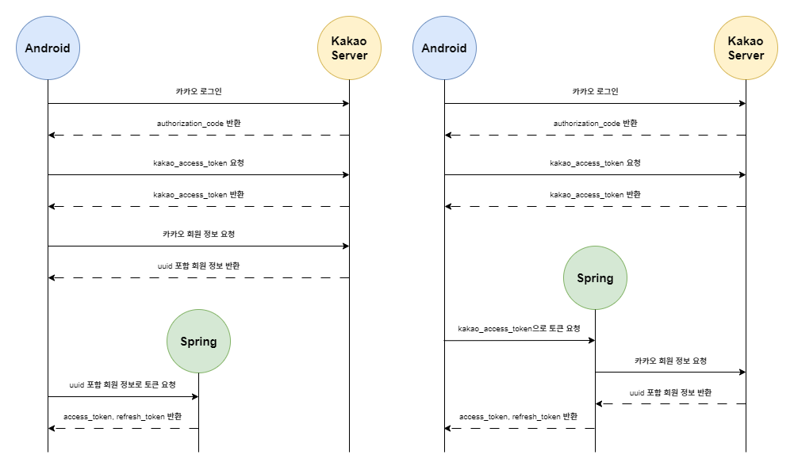

## 로그인 및 식별 관련
현재 저희 서비스 같은 경우 카카오 로그인에 상당 부분 의존하고 있는 상황입니다. 하지만 서비스는 **등록된 회원**을 기준으로 합니다.
그렇기 때문에 저희는 로그인 자체는 카카오 로그인을 사용하더라도 내부 서비스에 대한 요청은 **자체 JWT 토큰**을 사용합니다.
그리고 로그인 및 회원가입 등 **카카오 연관 서비스들은 안드로이드 SDK를 이용**해 처리하기로 하였습니다.

### 질문
위 배경에 따라 로그인 및 회원가입은 동일한 api 요청을 하고, db에 데이터 유무에 따라 회원 등록과 단순 로그인으로 나뉘게 될 것입니다.
oauth 특성상 password 필드가 존재하지 않으므로 여기서 데이터 유무에 대한 식별을 위해 저희는 **카카오 제공 uuid**를 사용하기로 했습니다.
이 **uuid를 사용하는 것이 괜찮은지**, 그리고 **권장되지 않을 때의 대안**은 어떤 것이 있는지 궁금합니다.

## OAUTH를 활용한 로그인 구현
카카오 관련 서비스는 안드로이드 SDK로 처리하고 있으며, 저희 서비스의 회원은 주식별자 제외 uuid로도 식별 가능합니다.

### 질문
안드로이드가 카카오 회원 정보까지 받아온 후, 해당 uuid로 인증하는 것과
안드로이드가 받아온 카카오 토큰으로 백과 카카오가 통신하며 인증하는 것 중에 어떤 것이 더 나은지 궁금합니다.

