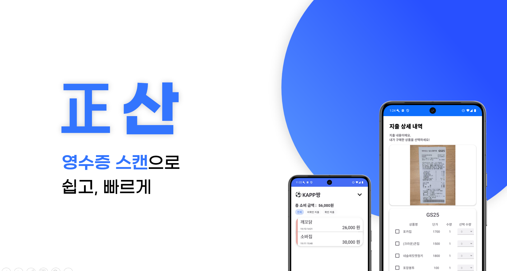
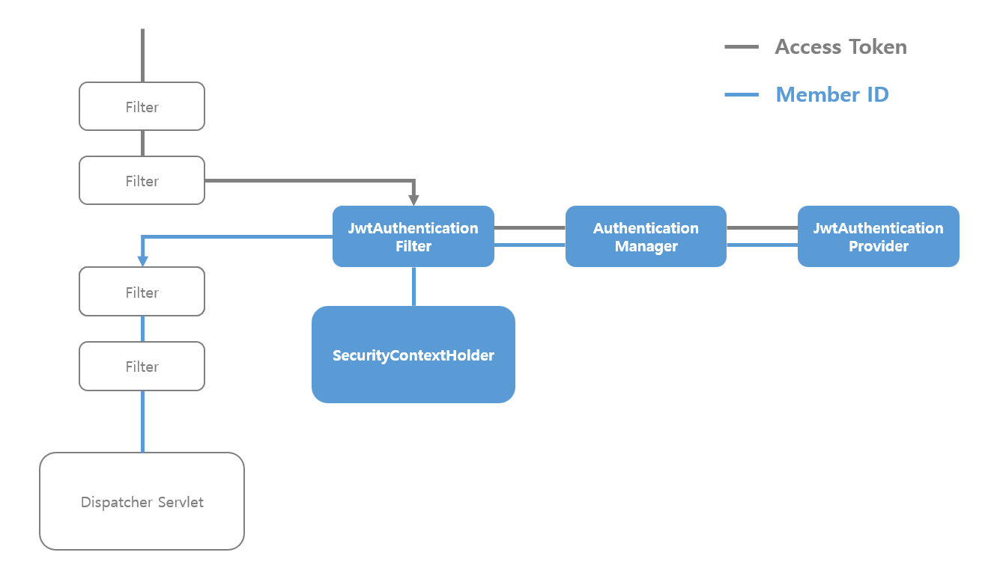
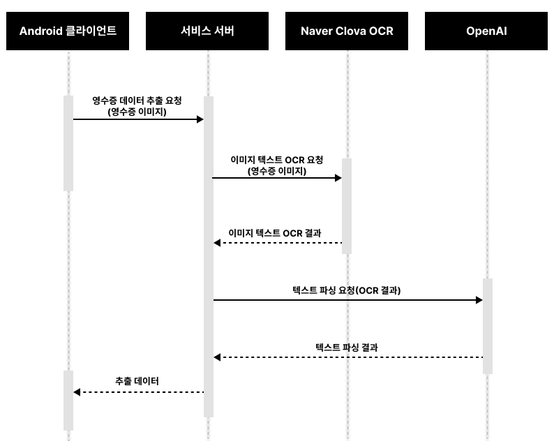
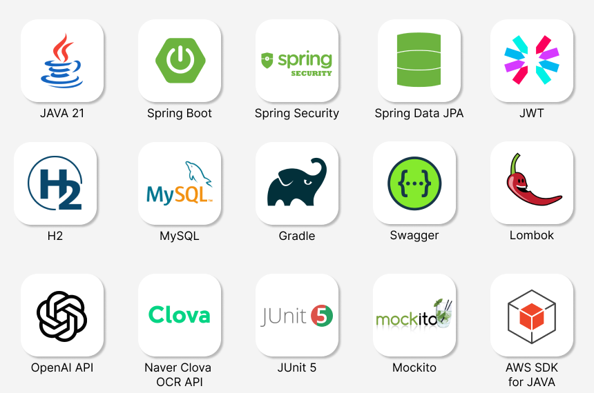

# KAPP짱 - 正산
> 우리 모임의 지출 관리를 쉽고 편하게!



## 기획 의도
> 正산은 여행, 동호회 등 다양한 모임에서 발생하는 복잡한 정산 과정을 간편하게 해결해주는 서비스입니다. 기존의 유사 서비스들이 모임 내 지출 금액을 단순히 1/N로 나누는 기능만 제공하는 데 반해, 저희 서비스는 **OCR 기술**을 통해 모임에서 발생한 지출 영수증의 소비된 상품명과 수량을 자동으로 추출하여 **사용자가 실제 소비한 내역을 직접 선택할 수 있는 기능을 지원**합니다. 이를 통해 실제 소비 내역을 기반으로 한 세부적인 정산이 가능합니다. **正산**은 모임 내 정산을 더욱 편리하고 정확하게 만들어 사용자에게 차별화된 정산 경험을 제공합니다.

## Deploy Link
> Backend | _[http://ecs-alb-50894514.ap-northeast-2.elb.amazonaws.com/](http://ecs-alb-50894514.ap-northeast-2.elb.amazonaws.com/)_
>
> API Specs | _[github page release](https://kakao-tech-campus-2nd-step3.github.io/Team23_BE/api-spec.html)_
> 
> Android | _[OneStore](https://m.onestore.co.kr/ko-kr/apps/appsDetail.omp?prodId=0000779533)_

## Contributors

<!-- ALL-CONTRIBUTORS-LIST:START - Do not remove or modify this section -->
<!-- prettier-ignore-start -->
<!-- markdownlint-disable -->
<table>
  <tbody>
    <tr>
      <td align="center">
        <b>Android</b><br />
      </td>
      <td align="center">
        <b>Android</b><br />
      </td>
      <td align="center">
        <b>Android</b><br />
      </td>
    </tr>
    <tr>
      <td align="center" valign="top" width="14.28%">
        <a href="https://github.com/jsh00325"><br /><sub><b>정수현</b></sub></a><br />
        <a href="https://github.com/kakao-tech-campus-2nd-step3/Team23_Android/commits?author=jsh00325" title="Code">💻</a>
        <a href="https://github.com/kakao-tech-campus-2nd-step3/Team23_Android/pulls?q=is%3Apr+reviewed-by%3Ajsh00325" title="Reviewed Pull Requests">👀</a>
      </td>
      <td align="center" valign="top" width="14.28%">
        <a href="https://github.com/ksc1008"><br /><sub><b>권성찬</b></sub></a><br />
        <a href="https://github.com/kakao-tech-campus-2nd-step3/Team23_Android/commits?author=ksc1008" title="Code">💻</a>
        <a href="https://github.com/kakao-tech-campus-2nd-step3/Team23_Android/pulls?q=is%3Apr+reviewed-by%3Aksc1008" title="Reviewed Pull Requests">👀</a>
      </td>
      <td align="center" valign="top" width="14.28%">
        <a href="https://github.com/cleonno3o"><br /><sub><b>주수민</b></sub></a><br />
        <a href="https://github.com/kakao-tech-campus-2nd-step3/Team23_Android/commits?author=cleonno3o" title="Code">💻</a>
        <a href="https://github.com/kakao-tech-campus-2nd-step3/Team23_Android/pulls?q=is%3Apr+reviewed-by%3Acleonno3o" title="Reviewed Pull Requests">👀</a>
      </td>
    </tr>
  </tbody>
</table>

<table>
  <tbody>
    <tr>
      <td align="center">
        <b>Backend</b><br />
      </td>
      <td align="center">
        <b>Backend</b><br />
      </td>
      <td align="center">
        <b>Backend</b><br />
      </td>
      <td align="center">
        <b>Backend</b><br />
      </td>
    </tr>
    <tr>
      <td align="center" valign="top" width="14.28%">
        <a href="https://github.com/us4c0d3"><br /><sub><b>장우석</b></sub></a><br />
        <a href="https://github.com/kakao-tech-campus-2nd-step3/Team23_BE/commits?author=us4c0d3" title="Code">💻</a>
        <a href="https://github.com/kakao-tech-campus-2nd-step3/Team23_BE/pulls?q=is%3Apr+reviewed-by%3Aus4c0d3" title="Reviewed Pull Requests">👀</a>
      </td>
      <td align="center" valign="top" width="14.28%">
        <a href="https://github.com/minju26"><br /><sub><b>김민주</b></sub></a><br />
        <a href="https://github.com/kakao-tech-campus-2nd-step3/Team23_BE/commits?author=minju26" title="Code">💻</a>
        <a href="https://github.com/kakao-tech-campus-2nd-step3/Team23_BE/pulls?q=is%3Apr+reviewed-by%3Aminju26" title="Reviewed Pull Requests">👀</a></td>
      <td align="center" valign="top" width="14.28%">
        <a href="https://github.com/Lucerna00"><br /><sub><b>박준석</b></sub></a><br />
        <a href="https://github.com/kakao-tech-campus-2nd-step3/Team23_BE/commits?author=Lucerna00" title="Code">💻</a>
        <a href="https://github.com/kakao-tech-campus-2nd-step3/Team23_BE/pulls?q=is%3Apr+reviewed-by%3ALucerna00" title="Reviewed Pull Requests">👀</a>
      </td>
      <td align="center" valign="top" width="14.28%">
        <a href="https://github.com/dkswoals"><br /><sub><b>안재민</b></sub></a><br />
        <a href="https://github.com/kakao-tech-campus-2nd-step3/Team23_BE/commits?author=dkswoals" title="Code">💻</a>
        <a href="https://github.com/kakao-tech-campus-2nd-step3/Team23_BE/pulls?q=is%3Apr+reviewed-by%3Adkswoals" title="Reviewed Pull Requests">👀</a>
      </td>
    </tr>
  </tbody>
</table>
<!-- markdownlint-restore -->
<!-- prettier-ignore-end -->
<!-- ALL-CONTRIBUTORS-LIST:END -->

## 주요 기능
### [User]
#### 회원가입
- 서비스 이용에 필요한 카카오 정보를 저장하고 토큰을 발급받는 기능

#### 로그인
- 카카오 이메일로 서비스 이용에 필요한 토큰을 발급받는 기능

#### 인증 & 인가

- 스프링 시큐리티 필터 체인에 JWT를 접목하여 인증 & 인가 구현

#### 토큰 재발급
- 보안으로 인해 유효 기간이 짧은 액세스 토큰을 재발급받는 기능

#### 모임 초대 수락
- 모임에 초대 받은 사용자가 초대를 수락하여 모임에 참여하는 기능


### [Team]
#### 모임 조회
- 자신이 속해 있는 모임의 전체 또는 특정 하나를 지정해서 조회하는 기능
- 자신이 속해 있지 않은 모임에 대한 조회를 요청할 경우 예외 발생

#### 모임 생성
- 모임을 생성하는 기능
- 모임 생성 요청자가 owner가 되도록 처리

#### 모임 종료
- “진행중인 모임”을 “완료된 모임”으로 상태를 변경하는 기능

#### 모임 멤버 초대 현황 조회
- 모임 초대 요청을 받은 사용자들의 초대 수락 여부를 확인하는 기능

#### 모임 멤버 카카오 서비스 아이디 조회
- 특정 모임에서 멤버들의 카카오 서비스 아이디를 조회하는 기능


### [Expense]
#### 지출 목록 조회
- 지출 내역의 상태에 따라 구분하여 조회하는 기능
- 지출 내역의 상태는 쿼리 파라미터를 이용
- 대기 상태의 지출 목록 조회의 경우, 지출에 대한 사용자의 총 소비 금액과 지출 단위 사용자 소비 금액 조회를 포함
- “정산 중(`ongoing`)” 상태의 지출 내역은 API 요청자가 확인했는지 여부를 `isChecked` 쿼리 파라미터를 통해 구분하여 조회
    - `isChecked` 의 경우 실제로 DB에 저장된 데이터가 아닌, 유저가 저장하도록 한 item 데이터의 개수와 실제 지출 내역의 항목의 개수가 동일하면 **유저가 이 지출을 모두 확인했다**는 의미(JPQL로 구현)

#### 내가 결제한 지출 목록 조회
- 지출 목록 중 결제한 사람(등록한 사람)이 자신인 데이터를 조회하는 기능

#### 카테고리 조회
- 지출에는 카테고리를 지정할 수 있음
- 그러나 아직 카테고리를 커스텀하는 기능은 없고, 존재하는 데이터 중 선택하도록 함
- DB에 저장되어있는 카테고리에 대한 정보를 조회하는 기능

#### 영수증 내역 분석
- 영수증 이미지에서 지출 상세 정보를 추출하는 기능
- **이미지 데이터 추출 과정** <br />
  
- **Naver Clova Document OCR**(영수증 분석 특화 API) 사용의 경우 비용이 높은 편으로
**Naver Clova General OCR**(단순 이미지 텍스트 추출 API)로 이미지에서 텍스트 추출 후
미리 학습된 **ChatGPT fine-tuning API**를 통해 해당 텍스트를 영수증 형식으로 파싱
  - **처리 소요 시간**
    - **Naver Clova OCR**: 1.5~2초
    - **ChatGPT fine-tuning**: 2~3초

#### 지출 내역 저장
- 영수증 분석 결과, 또는 수기로 작성된 지출 내역을 저장하는 기능
- 영수증 이미지 저장
  - 이미지는 **AWS SDK Client**를 통해 **AWS S3**에 저장
  - 데이터베이스에는 S3 Bucket 내의 상대 경로만 저장
  - 이후 해당 이미지 조회 시 **S3 Presigner**를 통해 **PersignedURL**로 변환 후 클라이언트로 전달하여 보안성 유지 (S3 Bucket 명 은닉 + 이미지 접근 시간 제한)

#### 지출 상세 내역 조회
- 모임 지출의 상세 내역을 조회하는 기능

#### 지출 선택 현황 조회
- 모임 지출의 품목 선택 현황을 조회하는 기능

#### 개인 소비 내역 저장 및 수정
- 모임 지출 내에서 개인이 실제로 소비한 항목을 선택하여 개인 소비 내역을 저장 및 수정하는 기능
- 개인 소비 내역 저장 내역이 존재한다면 새로운 수량으로 수정


### [Transfer]
#### 송금 요청 대상 및 금액 조회
모임 지출 결제자가 송금 요청을 보낼 모임 멤버와 금액을 조회하는 기능

#### _송금 링크 조회_
- _모임 지출 결제자의 카카오 페이 송금 링크를 조회하는 기능_
- _링크 생성을 위해 카카오 페이 디벨로퍼 사업자 등록이 필요하므로 사용하지 않음_


### Code Coverage

|Overall Project|84.34%|
|:-|:-|

| Element     | Missed | Covered | Coverage (%) |
|-------------|--------|---------|--------------|
| kappzzang/jeongsan/service/MemberService | 8 | 26 | 76.47% |
| kappzzang/jeongsan/service/TeamService | 20 | 35 | 63.64% |
| kappzzang/jeongsan/service/ExpenseService | 5 | 120 | 96.00% |
| kappzzang/jeongsan/service/ReceiptService | 2 | 7 | 77.78% |
| kappzzang/jeongsan/service/CategoryService | 0 | 4 | 100.00% |
| kappzzang/jeongsan/service/ImageStorageService | 3 | 11 | 78.57% |
| kappzzang/jeongsan/service/PersonalExpenseService | 2 | 33 | 94.29% |
| kappzzang/jeongsan/domain/PersonalExpense | 2 | 8 | 80.00% |
| kappzzang/jeongsan/domain/Item | 0 | 10 | 100.00% |
| kappzzang/jeongsan/domain/KakaoPayInfo | 0 | 3 | 100.00% |
| kappzzang/jeongsan/domain/Expense | 5 | 46 | 90.20% |
| kappzzang/jeongsan/domain/Member | 1 | 17 | 94.44% |
| kappzzang/jeongsan/domain/Category | 0 | 4 | 100.00% |
| kappzzang/jeongsan/domain/Team | 1 | 43 | 97.73% |
| kappzzang/jeongsan/domain/TeamMember | 0 | 10 | 100.00% |

---
## Project Architecture
### Tech Stack
#### BackEnd


#### InfraStructure


### Directory Structure
```text
./src
├─main
│  ├─java
│  │  └─kappzzang
│  │      └─jeongsan
│  │          ├─controller
│  │          │  └─docs
│  │          ├─domain
│  │          ├─dto
│  │          │  ├─request
│  │          │  └─response
│  │          ├─global
│  │          │  ├─client
│  │          │  │  ├─aws
│  │          │  │  ├─clova
│  │          │  │  ├─dto
│  │          │  │  │  ├─request
│  │          │  │  │  └─response
│  │          │  │  └─openai
│  │          │  ├─common
│  │          │  │  ├─annotation
│  │          │  │  ├─dto
│  │          │  │  ├─enumeration
│  │          │  │  ├─security
│  │          │  │  ├─swagger
│  │          │  │  └─util
│  │          │  ├─config
│  │          │  ├─exception
│  │          │  └─interceptor
│  │          ├─repository
│  │          └─service
│  └─resources
│      └─prompts
└─test
    ├─java
    │  └─kappzzang
    │      └─jeongsan
    │          ├─controller
    │          ├─domain
    │          ├─global
    │          │  └─client
    │          ├─repository
    │          └─service
    └─resources
```

### ERD


### System Architecture

