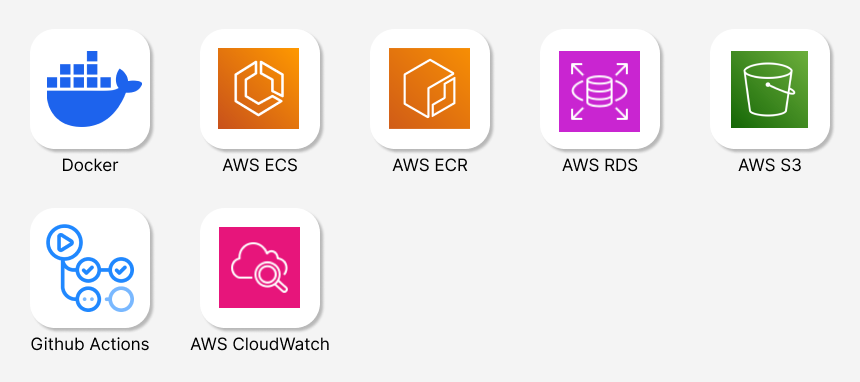
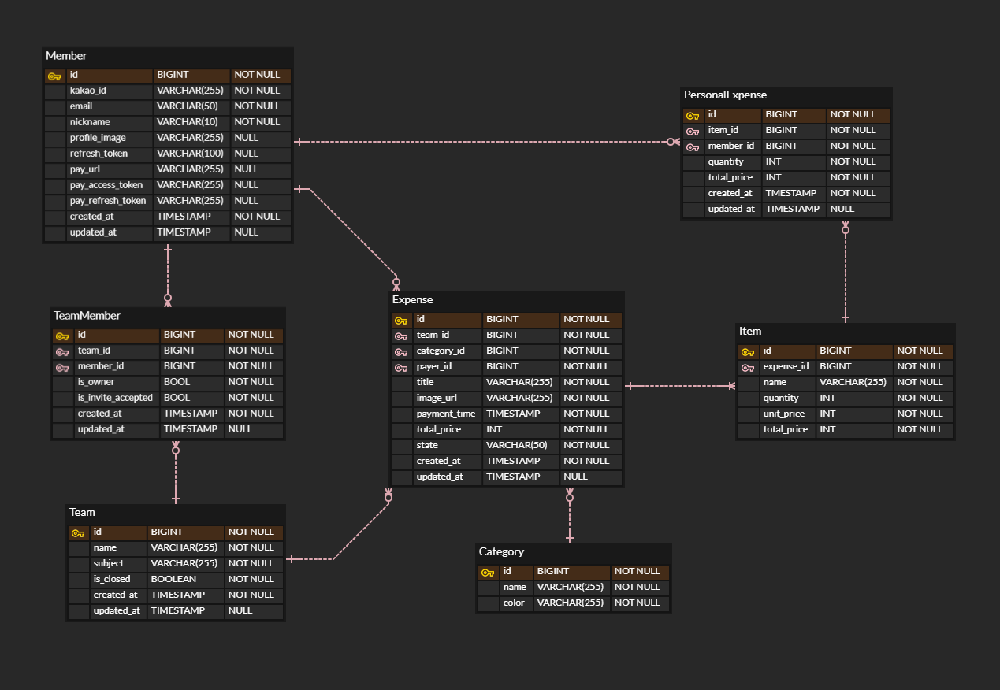

# 正산 - 더 편하고 빠른 정산

## 기획 의도
> 正산은 여행, 동호회 등 다양한 모임에서 발생하는 복잡한 정산 과정을 간편하게 해결해주는 서비스입니다. 기존의 유사 서비스들이 모임 내 지출 금액을 단순히 1/N로 나누는 기능만 제공하는 데 반해, 저희 서비스는 **OCR 기술**을 통해 모임에서 발생한 지출 영수증의 소비된 상품명과 수량을 자동으로 추출하여 **사용자가 실제 소비한 내역을 직접 선택할 수 있는 기능을 지원**합니다. 이를 통해 실제 소비 내역을 기반으로 한 세부적인 정산이 가능합니다. **正산**은 모임 내 정산을 더욱 편리하고 정확하게 만들어 사용자에게 차별화된 정산 경험을 제공합니다.

## Deploy Link
> Backend: [Swagger API](http://ecs-alb-50894514.ap-northeast-2.elb.amazonaws.com/swagger-ui/index.html)
>
> Android: [github release](https://github.com/kakao-tech-campus-2nd-step3/Team23_Android/releases/tag/pre.1.3.0)

## Contributors

<!-- ALL-CONTRIBUTORS-LIST:START - Do not remove or modify this section -->
<!-- prettier-ignore-start -->
<!-- markdownlint-disable -->
<table>
  <tbody>
    <tr>
      <td align="center">
        <b>Android</b><br />
      </td>
      <td align="center">
        <b>Android</b><br />
      </td>
      <td align="center">
        <b>Android</b><br />
      </td>
    </tr>
    <tr>
      <td align="center" valign="top" width="14.28%">
        <a href="https://github.com/jsh00325"><br /><sub><b>정수현</b></sub></a><br />
        <a href="https://github.com/kakao-tech-campus-2nd-step3/Team23_Android/commits?author=jsh00325" title="Code">💻</a>
        <a href="https://github.com/kakao-tech-campus-2nd-step3/Team23_Android/pulls?q=is%3Apr+reviewed-by%3Ajsh00325" title="Reviewed Pull Requests">👀</a>
      </td>
      <td align="center" valign="top" width="14.28%">
        <a href="https://github.com/ksc1008"><br /><sub><b>권성찬</b></sub></a><br />
        <a href="https://github.com/kakao-tech-campus-2nd-step3/Team23_Android/commits?author=ksc1008" title="Code">💻</a>
        <a href="https://github.com/kakao-tech-campus-2nd-step3/Team23_Android/pulls?q=is%3Apr+reviewed-by%3Aksc1008" title="Reviewed Pull Requests">👀</a>
      </td>
      <td align="center" valign="top" width="14.28%">
        <a href="https://github.com/cleonno3o"><br /><sub><b>주수민</b></sub></a><br />
        <a href="https://github.com/kakao-tech-campus-2nd-step3/Team23_Android/commits?author=cleonno3o" title="Code">💻</a>
        <a href="https://github.com/kakao-tech-campus-2nd-step3/Team23_Android/pulls?q=is%3Apr+reviewed-by%3Acleonno3o" title="Reviewed Pull Requests">👀</a>
      </td>
    </tr>
  </tbody>
</table>

<table>
  <tbody>
    <tr>
      <td align="center">
        <b>Backend</b><br />
      </td>
      <td align="center">
        <b>Backend</b><br />
      </td>
      <td align="center">
        <b>Backend</b><br />
      </td>
      <td align="center">
        <b>Backend</b><br />
      </td>
    </tr>
    <tr>
      <td align="center" valign="top" width="14.28%">
        <a href="https://github.com/us4c0d3"><br /><sub><b>장우석</b></sub></a><br />
        <a href="https://github.com/kakao-tech-campus-2nd-step3/Team23_BE/commits?author=us4c0d3" title="Code">💻</a>
        <a href="https://github.com/kakao-tech-campus-2nd-step3/Team23_BE/pulls?q=is%3Apr+reviewed-by%3Aus4c0d3" title="Reviewed Pull Requests">👀</a>
      </td>
      <td align="center" valign="top" width="14.28%">
        <a href="https://github.com/minju26"><br /><sub><b>김민주</b></sub></a><br />
        <a href="https://github.com/kakao-tech-campus-2nd-step3/Team23_BE/commits?author=minju26" title="Code">💻</a>
        <a href="https://github.com/kakao-tech-campus-2nd-step3/Team23_BE/pulls?q=is%3Apr+reviewed-by%3Aminju26" title="Reviewed Pull Requests">👀</a></td>
      <td align="center" valign="top" width="14.28%">
        <a href="https://github.com/Lucerna00"><br /><sub><b>박준석</b></sub></a><br />
        <a href="https://github.com/kakao-tech-campus-2nd-step3/Team23_BE/commits?author=Lucerna00" title="Code">💻</a>
        <a href="https://github.com/kakao-tech-campus-2nd-step3/Team23_BE/pulls?q=is%3Apr+reviewed-by%3ALucerna00" title="Reviewed Pull Requests">👀</a>
      </td>
      <td align="center" valign="top" width="14.28%">
        <a href="https://github.com/dkswoals"><br /><sub><b>안재민</b></sub></a><br />
        <a href="https://github.com/kakao-tech-campus-2nd-step3/Team23_BE/commits?author=dkswoals" title="Code">💻</a>
        <a href="https://github.com/kakao-tech-campus-2nd-step3/Team23_BE/pulls?q=is%3Apr+reviewed-by%3Adkswoals" title="Reviewed Pull Requests">👀</a>
      </td>
    </tr>
  </tbody>
</table>
<!-- markdownlint-restore -->
<!-- prettier-ignore-end -->
<!-- ALL-CONTRIBUTORS-LIST:END -->

## Demo
> 시나리오에 따른 영상 추가 예정

## 주요 기능

## Project Architecture
### Tech Stack
#### BackEnd


#### InfraStructure


### Directory Structure
```text
./src
├─main
│  ├─java
│  │  └─kappzzang
│  │      └─jeongsan
│  │          ├─controller
│  │          │  └─docs
│  │          ├─domain
│  │          ├─dto
│  │          │  ├─request
│  │          │  └─response
│  │          ├─global
│  │          │  ├─client
│  │          │  │  ├─aws
│  │          │  │  ├─clova
│  │          │  │  ├─dto
│  │          │  │  │  ├─request
│  │          │  │  │  └─response
│  │          │  │  └─openai
│  │          │  ├─common
│  │          │  │  ├─annotation
│  │          │  │  ├─dto
│  │          │  │  ├─enumeration
│  │          │  │  ├─security
│  │          │  │  ├─swagger
│  │          │  │  └─util
│  │          │  ├─config
│  │          │  ├─exception
│  │          │  └─interceptor
│  │          ├─repository
│  │          └─service
│  └─resources
│      └─prompts
└─test
    ├─java
    │  └─kappzzang
    │      └─jeongsan
    │          ├─controller
    │          ├─domain
    │          ├─global
    │          │  └─client
    │          ├─repository
    │          └─service
    └─resources
```

### ERD


### System Architecture

